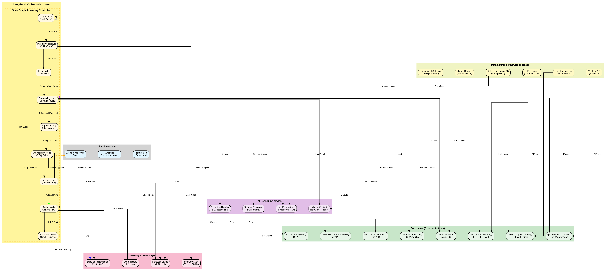

# Dynamic Inventory Reorder Agent

> A production-style multi-agent LLM system that autonomously manages inventory procurement — built on **LangGraph**, **ChromaDB**, **Groq** (Llama 3.3-70B), with full RAG, guardrails, persistent memory, and human-in-the-loop approval.


---

## What it does

An autonomous AI agent for an electronics retailer that:
1. **Forecasts demand** for 500+ SKUs from historical sales, seasonality, and market signals.
2. **Synthesizes data** across sales, inventory, supplier catalogs, weather, and competitor pricing.
3. **Generates purchase orders** with optimal quantity / supplier / timing under cost, lead-time, and storage constraints.
4. **Routes high-value POs** through a human-in-the-loop approval gate before execution.
5. **Logs and evaluates** every decision against a frozen eval dataset to detect drift over time.

**Business impact modelled in the PRD**: ~$2M lost-sale recovery and ~$500K excess-inventory reduction at a single mid-sized retailer.

> 📄 Full design rationale and stakeholder mapping → [`PRD.md`](PRD.md)
> 📄 Architectural deep-dive and component-level walkthrough → [`Technical_Report.md`](Technical_Report.md)
> 📄 Deployment & ops report → [`Part_A/Deployment_Report.md`](Part_A/Deployment_Report.md)

## Architecture



The system has two independent pipelines:

### Part A — Agentic pipeline (LangGraph)
A multi-agent graph where specialized agents collaborate through a shared tool layer and an approval node.

- **Procurement Analyst Agent** — runs RAG over supplier docs, forecasts demand, recommends order quantities.
- **Order Manager Agent** — validates against budget / storage policy and drafts purchase orders.
- **Approval node** — routes orders above a threshold to a human reviewer; auto-approves below.
- **Tool layer** — `get_sales_data`, `forecast_demand`, `get_current_inventory`, `query_all_suppliers`, `place_order`, etc.
- **Persistence** — SQLite-backed LangGraph checkpointer; conversation + state survive restarts.
- **Guardrails** — input/output sanitization and policy checks in [`guardrails_config.py`](Part_A/guardrails_config.py).

### Part B — Model Context Protocol (MCP) pipeline
A standalone MCP server/client that exposes the same procurement tools over the MCP protocol, demonstrating tool portability across MCP-compatible clients.

### Final Exam extension — Self-RAG agent
A self-evaluating RAG variant ([`Final_Exam/Part_B/self_rag_agent.py`](Final_Exam/Part_B/self_rag_agent.py)) that critiques and rewrites its own retrievals before generation.

## Tech stack

| Layer | Tech |
|---|---|
| Orchestration | LangGraph 1.0+ |
| LLM | Groq (Llama 3.3-70B-versatile) via `langchain-groq` |
| RAG / vector store | ChromaDB + sentence-transformers |
| API surface | FastAPI + Streamlit dashboard |
| Persistence | SQLite (LangGraph checkpointer) |
| Tool protocol | Model Context Protocol (MCP) |
| Observability | LangSmith tracing |
| Deployment | Docker + docker-compose |

## Evaluation

A frozen eval dataset (`Part_A/test_dataset.json`) is run through the graph nightly. Metrics tracked: groundedness, tool-call correctness, hallucination rate, and end-to-end latency. Thresholds and drift analysis in `Part_A/eval_thresholds.json` and `Part_A/drift_report.md`.

A breaking-change CI demo (`Part_A/ci_breaking_change_demo.py`) shows how the pipeline catches regressions — see `ci_pass_log.txt` vs `ci_fail_log.txt`.

## Repository layout

```
AI-Capstone-Lab/
├── Part_A/                  # Main agentic pipeline (LangGraph + RAG + guardrails)
│   ├── app.py               # FastAPI + Streamlit entry point
│   ├── multi_agent_graph.py # Agent graph definition
│   ├── agents_config.py     # Agent personas + tool bindings
│   ├── tools.py             # Tool implementations
│   ├── guardrails_config.py # Input/output guardrails
│   ├── approval_logic.py    # Human-in-the-loop gate
│   ├── ingest_data.py       # ChromaDB ingestion pipeline
│   ├── run_eval.py          # Eval harness
│   ├── Dockerfile           # Containerised deployment
│   └── docker-compose.yaml
├── Part_B/                  # MCP server/client variant
├── Final_Exam/              # Self-RAG extension + feedback analysis
├── Technical_Report.md      # Full design walkthrough
├── PRD.md                   # Product requirements & business case
├── Architecture_Diagram.png
├── tests/                   # Smoke tests
└── requirements.txt
```

## Getting started

### Prerequisites
- Python 3.10+
- A Groq API key (free tier works) — get one at https://console.groq.com
- Docker (optional, for containerised run)

### Local run

```bash
git clone https://github.com/MuhammadHashimRN/AI-Capstone-Lab.git
cd AI-Capstone-Lab

python -m venv .venv
source .venv/bin/activate   # Windows: .venv\Scripts\activate
pip install -r requirements.txt

cp Part_A/.env.example Part_A/.env       # add your GROQ_API_KEY
cd Part_A
python ingest_data.py                    # one-time: build vector store
streamlit run app.py
```

### Docker

```bash
cd Part_A
docker compose up --build
```

### Run the evaluation suite

```bash
cd Part_A
python run_eval.py
```

## What's notable about this project (for engineering reviewers)

- **End-to-end agentic system**, not a chatbot — actually executes business actions (PO drafting, supplier selection).
- **Production concerns addressed**: persistence, observability (LangSmith), guardrails, eval harness, drift detection, dockerized deployment.
- **CI integration** with a breaking-change regression demo that fails the build when the eval suite drifts beyond thresholds.
- **MCP variant** demonstrates protocol-level tool portability.
- **Two report-quality docs** (PRD + Technical Report) — strong product/engineering communication.

## Author

**Muhammad Hashim** — BS Artificial Intelligence, GIK Institute (2026)
📧 muhammad808alvi@gmail.com · 🔗 [github.com/MuhammadHashimRN](https://github.com/MuhammadHashimRN)

## License

[MIT](LICENSE)
